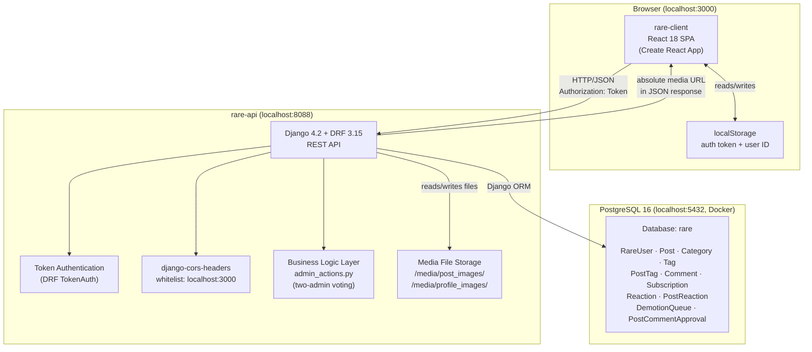

# RARE System Architecture

## Overview

RARE is a full-stack content publishing platform with an editorial approval workflow and a two-admin governance system. It consists of three runtime components: a React SPA, a Django REST API, and a PostgreSQL database.

## Component Diagram

## Components

| Component | Role | Tech |
|-----------|------|------|
| **rare-client** | Single-page app; all user-facing UI, client-side routing, and API calls | React 18, React Router 6, Bulma CSS |
| **rare-api** | REST API; business logic, auth, file uploads, approval workflow | Python, Django 4.2, DRF 3.15 |
| **PostgreSQL 16** | Persistent data store for all application models | PostgreSQL, Docker Compose |

## Communication

| From | To | Protocol | Auth |
|------|----|----------|------|
| rare-client | rare-api | HTTP/JSON (port 8088) | `Authorization: Token <token>` header (stored in `localStorage`) |
| rare-api | PostgreSQL | Django ORM over TCP (port 5432) | DB credentials in `settings.py` |
| Browser | rare-api `/media/` | HTTP GET | none (public URLs) |

## Key Workflows

### Authentication
1. Client POSTs credentials to `/login` or `/register`.
2. API returns a DRF auth token.
3. Client stores token + user ID in `localStorage` and sends token in every subsequent request header.
4. On page refresh, client calls `/me` to rehydrate auth state.

### Post Approval
- Admin (`is_staff=True`) posts are **auto-published**.
- Regular author posts enter a **moderation queue** and require admin approval before appearing publicly.

### Two-Admin Governance
- Demoting or deactivating an admin requires a second admin's confirmation vote.
- The last active admin cannot be demoted, enforced by `admin_actions.py`.
