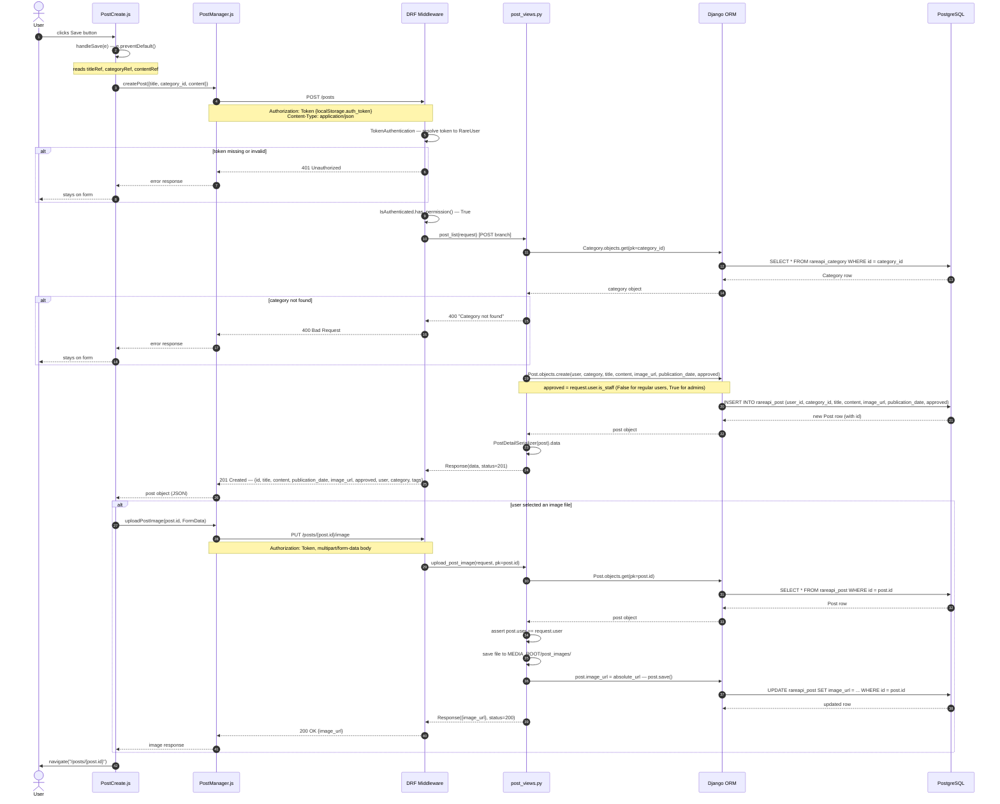

# Create Post — Sequence Diagram

Traces the full flow from the user clicking **Save** on the new-post form in the React client through to the database write on the Django API.

## Key notes

| Detail | Value |
|---|---|
| Client entry point | `PostCreate.handleSave()` — `rare-client/src/components/posts/PostCreate.js` |
| API manager | `createPost()` — `rare-client/src/managers/PostManager.js` |
| Auth scheme | DRF `TokenAuthentication`; token stored in `localStorage.auth_token` |
| Create endpoint | `POST /posts` → `post_list()` in `rare-api/rareapi/views/post_views.py` |
| Image endpoint | `PUT /posts/<pk>/image` → `upload_post_image()` in the same file |
| ORM call | `Post.objects.create(...)` — no manual SQL |
| `approved` logic | `True` when `request.user.is_staff`, else `False` (pending moderation) |
| Image upload | Separate `PUT` request after the post is created; `image_url` defaults to `""` |
