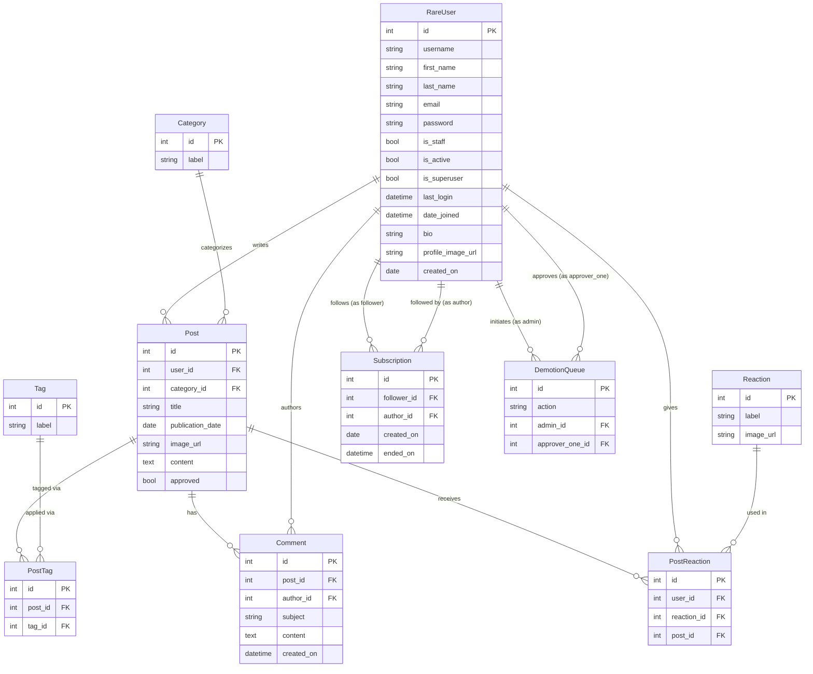

# Database Schema

## Notes

- `RareUser` extends Django's `AbstractUser`; fields above `bio` are inherited from it.
- `PostTag` is a join table between `Post` and `Tag` (many-to-many).
- `PostReaction` is a three-way join table linking `RareUser`, `Post`, and `Reaction`.
- `Subscription` has two foreign keys to `RareUser`: `follower` (the subscriber) and `author` (the person being followed).
- `DemotionQueue` has two foreign keys to `RareUser`: `admin` (who initiated the demotion) and `approver_one` (who approved it). The combination of `(action, admin, approver_one)` is unique.
- `Subscription.ended_on` is nullable — a `NULL` value means the subscription is still active.
